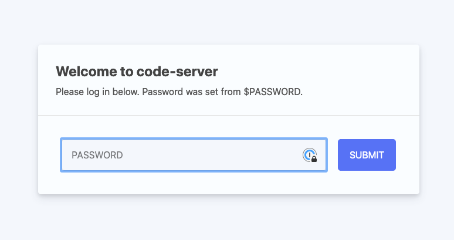

# Welcome to cdk-vscode-fargate

`cdk-vscode-fargate` is a JSII construct library for AWS CDK that allows you to deploy [Code-server](https://github.com/orgs/linuxserver/packages/container/package/code-server) running VS Code remotely, on a AWS Fargate container.

By deploying the `VSCodeFargate` construct, the following resources will be created:

1. VPC (if not passed in as a prop)
2. ACM DNS validated certificate
3. ECS Cluster
4. EFS file system
5. ALB Fargate Service
6. Security Groups
7. Secrets Manager secret (for login authorization)

## Howto

Create a new project with AWS CDK

```sh
$ mkdir my-vscode-fargate && cd my-vscode-fargate
# initialize the AWS CDK project
$ cdk init -l typescript
# install the cdk-vscode-fargate npm module
$ yarn add cdk-vscode-fargate
```

# AWS CDK sample

Building your serverless VS Code service with the `VSCodeFargate` construct:

Update `./lib/my-vscode-fargate-stack.ts`

```ts
import * as ec2 from '@aws-cdk/aws-ec2';
import * as cdk from '@aws-cdk/core';
import { VSCodeFargate } from 'cdk-vscode-fargate';

export class CdkStack extends cdk.Stack {
  constructor(scope: cdk.Construct, id: string, props?: cdk.StackProps) {
    super(scope, id, props);

    const subdomain = process.env.VSCODE_SUBDOMAIN ?? 'vscode';
    const domainName = process.env.VSCODE_DOMAIN_NAME ?? 'mydomain.com';

    const vpc = ec2.Vpc.fromLookup(this, 'Vpc', {
      isDefault: true,
    });

    new VSCodeFargate(this, 'MyVSCodeFargate', {
      domainName,
      subdomain,
      vpc,
    });
  }
}
```

diff the CDK stack:

```sh
$ cdk deploy
```

deploy the CDK stack:

```sh
$ cdk diff
```

On deploy completion, the subdomain/domain name assigned to the load balancer will be returned in the Output. Click the URL and you will see the login page:



